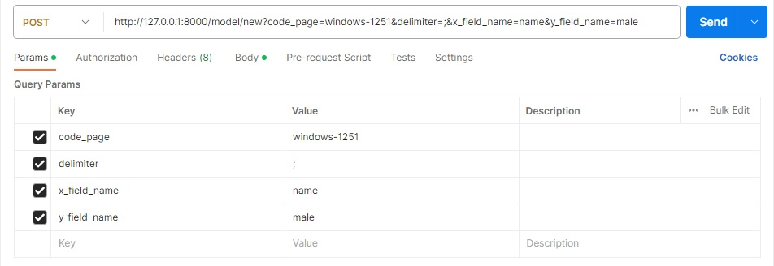
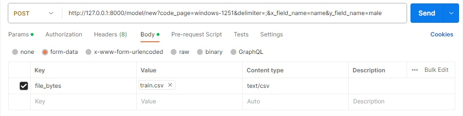
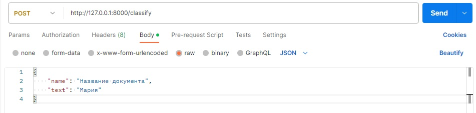

# Flexberry.TextClassifierAI.Sample

## Взаимодействие с сервисом классификации

Документация по API для взаимодействия с сервисом классификации доступна по следующему адресу: `http://127.0.0.1:8000/docs`, где `http://127.0.0.1` – адрес сервера с сервисом классификации.

### Обучение новой модели классификатора scikit-learn

Для обучения новой модели необходимо выполнить запрос к узлу сервиса `/model/new`, прикрепив csv-файл с данными для обучения и указав следующие параметры запроса:
- `code_page` – кодировка, используемая в прикрепляемом csv-файле (например: utf-8, windows-1251 и др.). По умолчанию: windows-1251.
- `delimiter` – символ разделитель, используемый в прикрепляемом csv-файле. По умолчанию: символ точка с запятой.
- `x_field_name` – имя поля с признаком категории. Обязательно должно быть задано!
- `y_field_name` – имя поля с категориями для классификации. Обязательно должно быть задано!

Параметры запроса, с заданными значениями по умолчанию, можно не передавать.

#### Пример запроса в Postman

Основные параметры.

Прикреплённый файл.

В случае успешного выполнения запроса, в ответе придёт сообщение: "Classifier model was successfully created!".

### Классификация текста

Для классификации текста необходимо отправить запрос на узел сервиса `/classify` и передать в запросе JSON-объект следующего содержания:
- `name` – имя классифицируемого документа.
- `text` – текст документа, согласно которому будет проводиться классификация документа к определенной категории. 

#### Пример запроса в Postman

В случае успешного выполнения запроса, в ответе придёт JSON-объект с полем `text_category` со значением категории классифицируемого документа.